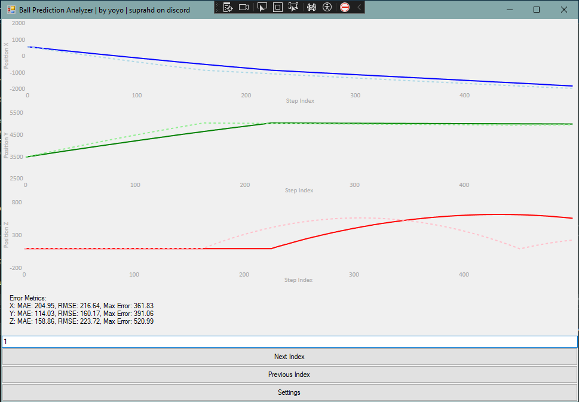

# BallDataVisualizer

BallDataVisualizer is a Windows Forms application for visualizing actual and predicted ball position data over time using charts. The application reads data from CSV files, displays it on interactive charts, and calculates error metrics such as Mean Absolute Error (MAE), Root Mean Squared Error (RMSE), and Max Error.

## Features

- **Visualize Ball Position**: Displays actual and predicted ball positions over time on X, Y, and Z axes using charts.
- **Navigate Data Chunks**: Easily navigate through data chunks using "Next" and "Previous" buttons or jump to a specific chunk by entering its index.
- **Settings Configuration**: Customize data chunk size and file paths for actual and predicted data through a settings interface.
- **Error Metrics**: Calculate and display error metrics for each axis to evaluate prediction accuracy.
- **Offset Calculation**: Calculate and apply optimal offsets to synchronize data from different files.
- **Flexible Visualization Range**: Configure start and end points for visualization chunks.
- **Multiple Prediction Sources**: Load and analyze multiple predicted data sets for comparison.
- **Interactive UI**: Use controls like checkboxes and buttons for flexible data manipulation and visualization.

## Screenshot



## Getting Started

### Prerequisites

- .NET Framework (4.5 or higher)
- Windows OS
- Visual Studio (for building the solution)
- LiveCharts library for charting:
  - Install via NuGet Package Manager: `Install-Package LiveCharts.WinForms`

### CSV File Format

The application processes data from CSV files with the following header format:

```cpp
std::string csvHeader = "StepIndex,PositionX,PositionY,PositionZ,VelocityX,VelocityY,VelocityZ,AngularVelocityX,AngularVelocityY,AngularVelocityZ\n";
```

## Installation

1. Clone the repository:
```bash
git clone https://github.com/yourusername/BallDataVisualizer.git
cd BallDataVisualizer
```

2. Open the project in Visual Studio.

3. Build the solution.

4. Ensure that you have the required dependencies installed:
   - [.NET Framework](https://dotnet.microsoft.com/download/dotnet-framework)
   - [LiveCharts](https://v0.lvcharts.com/)

## Usage

1. Prepare your actual and predicted data CSV files with the specified header format.
2. Launch the application.
3. Use the **Settings** button to specify file paths and Prediction Chunk Size (Prediction Chunk Size = the number of prediction points that you calculate for each step index and Visualization Chunk Size = the number of points that you visualize on the charts).
4. Navigate through data using the **Next Index** and **Previous Index** buttons.
5. View error metrics and visual comparisons on the charts.
6. Use the Offset Calculation form to calculate and apply offsets to your predicted data.

## Contributing

Contributions are welcome! Please open an issue or submit a pull request if you would like to contribute.

## License

This project is licensed under the GNU GPL3 License. See the [LICENSE](LICENSE) file for more details.
